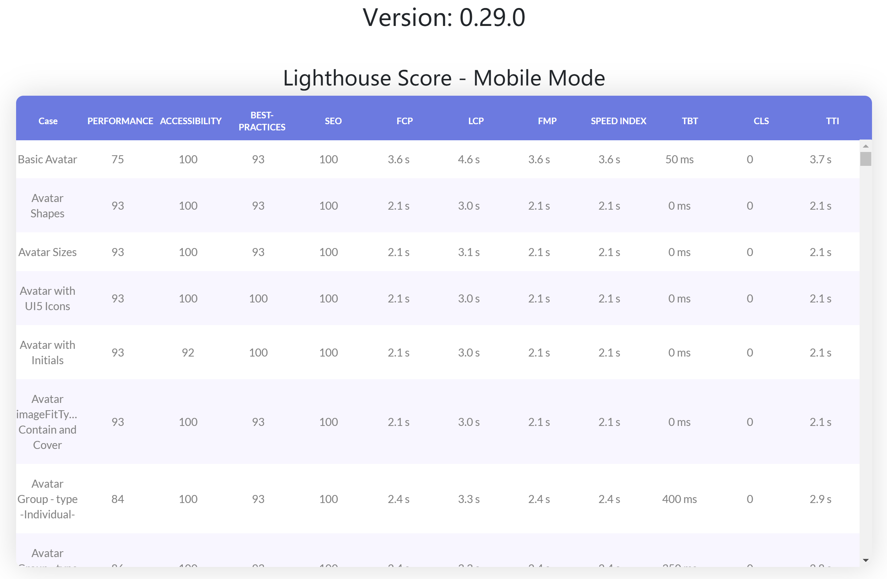

# UI5-WebComponent-PerfTool
The tool that used to measure the performance of ui5 webcomponents 

## Usage

1. Go to link: [https://milo-shen.github.io/UI5-WebComponent-PerfTool/](https://milo-shen.github.io/UI5-WebComponent-PerfTool/). And the lighthouse score of ui5-webcomponents will be listed there.

## Update score
You can update the version of `@ui5/webcomponents` and `@ui5/webcomponents-fiori` in `package.json` and then submit it. After the CI ( github action ) is done, the latest score will be uploaded to github pages ( [https://milo-shen.github.io/UI5-WebComponent-PerfTool/](https://milo-shen.github.io/UI5-WebComponent-PerfTool/) ) automatically.

## How do this perf tool test the lighthouse performance of ui5-webcomponents ?
1. clone the ui5-webcomponents code from [https://github.com/SAP/ui5-webcomponents.git](https://github.com/SAP/ui5-webcomponents.git) automatically.
2. scan the `ui5-webcomponents/packages/main/test/samples` folder and convert it's inner ui5-webcomponent examples to react projects
3. scan the `ui5-webcomponents/packages/fiori/test/samples` folder and convert it's inner ui5-webcomponent examples to react projects
4. build all the generated ui5-webcomponent react projects and run lighthouse cli tool to get scores of performance metrics
5. upload the performance score to github page automatically by using github action
6. all the above operations are done in github actions.
